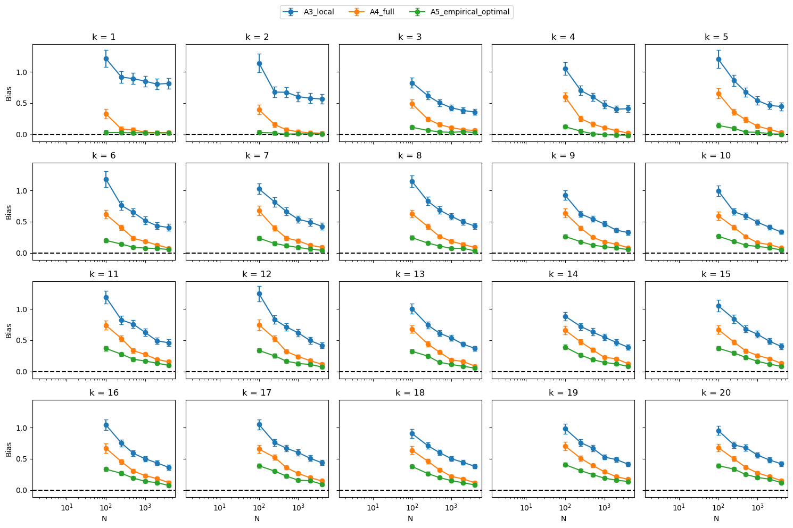

# Cell Death — Simulation et validation de filtres particulaires

Ce dépôt contient des codes de simulation et de validation numérique pour un modèle spatial stochastique de mort cellulaire avec :

Le dépôt permet notamment de comparer plusieurs constructions de filtres particulaires en étudiant le biais de l'estimation d'une quantité intégrée liée à la zone dans laquelle une mort peut avoir lieu.

---

## 1. Modèle spatial

Le domaine spatial est

$$
W=[0,L_x]\times[0,L_y].
$$

Le modèle contient trois processus principaux :

* \(V_t^a\) : processus latent des centres actifs de caspase ;
* \(V_t^d\) : processus observé des morts cellulaires ;
* \(V_t^p\) : processus des zones de protection ERK.

La zone active est définie par l'union des disques associés aux centres actifs :

$$
A(V_t^a)
=
W\cap
\bigcup_i B(Y_i^a,R_i^a).
$$

La zone dans laquelle une mort peut effectivement se produire est

$$
D_t
=
A(V_t^a)\setminus A(V_t^p).
$$

---

## 2. Intensité d'activation

L'intensité spatiale d'activation dépend de la position \(x\) et de l'état latent courant :

$$
\lambda_a(x\mid V_{t-}^a)
=
\begin{cases}
\lambda_{a,1},
& x\in A(V_{t-}^a),\\[4pt]
\lambda_{a,T},
& x\notin A(V_{t-}^a)
\text{ et }x\in T,\\[4pt]
\lambda_{a,c},
& \text{sinon}.
\end{cases}
$$

où \(T\) désigne une région spatiale fixe en forme de T.

Dans les simulations du dépôt, on impose

$$
0\leq \lambda_{a,c}
\leq \lambda_{a,T}
\leq \lambda_{a,1},
$$

ce qui permet d'utiliser un mécanisme de **thinning** à partir d'un processus dominant d'intensité \(\lambda_{a,1}\).

---

## 3. Processus de mort cellulaire

Conditionnellement à l'état latent, l'intensité spatiale de mort est

$$
\lambda_d(x,t)
=
\lambda_d
\mathbf 1_{\{x\in A(V_{t-}^a)\}}
\mathbf 1_{\{x\notin A(V_{t-}^p)\}}.
$$

Une mort ne peut donc se produire que :

1. à l'intérieur d'une zone active ;
2. en dehors des zones de protection ERK.

Après chaque mort observée, une nouvelle zone de protection ERK est créée.

Les rayons sont simulés selon

$$
R^a\sim \operatorname{Exp}(\beta_R^a),
\qquad
R^d\sim \operatorname{Exp}(\beta_R^d),
$$

et les disparitions des zones actives et ERK sont gouvernées respectivement par les taux

$$
\beta_T^a
\qquad\text{et}\qquad
\beta_T^d.
$$

---

# Structure du dépôt

```text
celldeath/
│
├── README.md
├── gillespiealgo .py
├── rejectionalgo.py
├── validate3pf.cpp
├── results.txt
├── plot.py
└── plot.png
```

---

## `gillespiealgo .py`

Simulation événementielle du modèle complet par un algorithme de type **Gillespie**.

Le programme regroupe quatre types d'événements :

1. proposition d'une activation ;
2. proposition d'une mort ;
3. disparition d'un centre actif ;
4. disparition d'une zone de protection ERK.

Le taux total de Gillespie est

$$
a_0
=
\lambda_{a,1}|W|
+
\lambda_d|W|
+
N_t^a\beta_T^a
+
N_t^p\beta_T^d.
$$

Le fichier produit également une visualisation dynamique :

* des activations acceptées ;
* des centres actifs ;
* des zones actives ;
* des morts observées ;
* des zones de protection ERK ;
* de la zone fixe en forme de T.

### Exécution

```bash
python "gillespiealgo .py"
```

---

## `rejectionalgo.py`

Implémentation alternative fondée sur la **simulation par rejet / thinning**.

Un processus ponctuel de Poisson dominant est d'abord simulé, puis chaque candidat d'activation est accepté avec une probabilité dépendant de sa position :

$$
p_{\mathrm{acc}}(x)
=
\frac{\lambda_a(x)}{\lambda_{a,1}}.
$$

Les candidats de mort sont ensuite conservés seulement lorsqu'ils appartiennent à la zone admissible

$$
D_t
=
A(V_t^a)\setminus A(V_t^p).
$$

Le script fournit également une animation du système spatial au cours du temps.

### Exécution

```bash
python rejectionalgo.py
```

---

# Validation des filtres particulaires

## `validate3pf.cpp`

Ce programme C++ simule des jeux de données selon le modèle de Gillespie, puis compare trois méthodes particulaires.

Pour chaque intervalle entre deux morts observées, on considère notamment

$$
B_k
=
\int_{S_{k-1}^d}^{S_k^d}
|D_t|\,dt.
$$

Le simulateur fournit la valeur vraie \(B_k^{\mathrm{true}}\), tandis que les filtres particulaires produisent une approximation de l'espérance conditionnelle de \(B_k\).

Trois méthodes sont comparées.

### A3 — `A3_local`

Le poids utilise uniquement une information locale à l'instant de la mort :

$$
G_k
\propto
\frac{
\mathbf 1_{\{Y_k^d\in D_{S_k^d-}\}}
}{
|D_{S_k^d-}|
}.
$$

Cette méthode est appelée dans la sortie :

```text
A3_local
```

---

### A4 — `A4_full`

Le poids prend en compte toute la survie sur l'intervalle :

$$
G_k
=
\lambda_d
\exp(-\lambda_d B_k)
\mathbf 1_{\{Y_k^d\in D_{S_k^d-}\}}.
$$

Cette méthode est appelée :

```text
A4_full
```

Elle incorpore donc explicitement le terme de survie

$$
\exp\left(
-\lambda_d
\int_{S_{k-1}^d}^{S_k^d}
|D_t|\,dt
\right).
$$

---

### A5 — `A5_empirical_optimal`

La troisième méthode utilise une approximation empirique de la proposition optimale.

Pour chaque particule, \(M_{\mathrm{prop}}\) trajectoires candidates sont simulées.

Chaque candidat possède un poids

$$
G_j
=
\lambda_d
e^{-\lambda_d B_j}
\mathbf 1_{\{Y_k^d\in D_{S_k^d-}^{(j)}\}}.
$$

Une trajectoire est ensuite sélectionnée proportionnellement à \(G_j\).

Le code utilise un **weighted reservoir sampling**, ce qui évite de conserver simultanément en mémoire les \(M_{\mathrm{prop}}\) candidats.

Le poids externe associé à la particule est approximé par

$$
\frac{1}{M_{\mathrm{prop}}}
\sum_{j=1}^{M_{\mathrm{prop}}}G_j.
$$

Cette méthode est appelée :

```text
A5_empirical_optimal
```

---

# Rééchantillonnage

Les trois filtres utilisent l'**Effective Sample Size**

$$
\operatorname{ESS}
=
\frac{1}{\sum_{i=1}^N (w_k^{(i)})^2}.
$$

Un rééchantillonnage est effectué lorsque

$$
\operatorname{ESS}\leq 0.75N.
$$

---

# Expérience de Monte-Carlo

Pour chaque nombre de particules

$$
N\in
\{100,250,500,1000,2000,4000\},
$$

le programme répète la simulation sur \(R\) jeux de données indépendants.

Par défaut :

```text
R = 500
K = 20
GRID_SIDE = 40
M_PROP = 20
ESS threshold = 0.75
```

Pour chaque segment \(k\) et chaque algorithme, le programme calcule notamment :

* le nombre de simulations réussies ;
* le nombre d'effondrements du filtre ;
* la moyenne des valeurs vraies ;
* la moyenne des estimations particulaires ;
* le biais ;
* la valeur absolue du biais ;
* la Monte-Carlo Standard Error du biais apparié.

---

# Compilation

Le programme nécessite un compilateur compatible avec **C++17**.

Avec OpenMP :

```bash
g++ -std=c++17 -O3 -DNDEBUG -fopenmp validate3pf.cpp -o validate3pf
```

Puis :

```bash
./validate3pf
```

Les arguments sont :

```text
./validate3pf R GRID_SIDE M_PROP
```

Par exemple :

```bash
./validate3pf 500 40 20
```

Pour enregistrer directement les résultats :

```bash
./validate3pf 500 40 20 > results.txt
```

---

# Format des résultats

Le programme produit des lignes de la forme

```text
N k algorithm success collapse mean_true_paired mean_PF bias abs_bias paired_MCSE
```

avec :

* `N` : nombre de particules ;
* `k` : numéro du segment ;
* `algorithm` : filtre utilisé ;
* `success` : nombre de répétitions réussies ;
* `collapse` : nombre d'effondrements ;
* `mean_true_paired` : moyenne des valeurs vraies ;
* `mean_PF` : moyenne des estimations particulaires ;
* `bias` : biais moyen ;
* `abs_bias` : valeur absolue du biais ;
* `paired_MCSE` : erreur standard Monte-Carlo du biais apparié.

---

# Visualisation des résultats

## `plot.py`

Ce script lit `results.txt` et trace le biais des trois méthodes en fonction du nombre de particules \(N\).

Pour chaque segment \(k\), il représente

$$
\operatorname{Bias}(N,k)
$$

avec des barres d'erreur correspondant à la MCSE.

L'axe du nombre de particules est représenté en échelle logarithmique.

### Dépendances

```bash
pip install pandas matplotlib
```

### Exécution

```bash
python plot.py results.txt plot.png
```

ou simplement

```bash
python plot.py
```

pour utiliser les noms par défaut :

```text
results.txt
plot.png
```

---

# Résultat graphique

Le fichier produit est disponible ici :



L'objectif principal de cette expérience est d'étudier la convergence des différentes approximations particulaires lorsque le nombre de particules \(N\) augmente, et de comparer le comportement des méthodes `A3_local`, `A4_full` et `A5_empirical_optimal`.

---

# Dépendances

## Python

Les scripts Python utilisent principalement :

```text
numpy
matplotlib
pandas
```

Installation :

```bash
pip install numpy matplotlib pandas
```

## C++

* compilateur compatible C++17 ;
* OpenMP recommandé pour paralléliser les répétitions Monte-Carlo.

Sous Linux :

```bash
sudo apt install g++
```

---

# Workflow recommandé

### 1. Simuler le modèle

```bash
python "gillespiealgo .py"
```

### 2. Compiler le programme de validation

```bash
g++ -std=c++17 -O3 -DNDEBUG -fopenmp validate3pf.cpp -o validate3pf
```

### 3. Lancer l'expérience Monte-Carlo

```bash
./validate3pf 500 40 20 > results.txt
```

### 4. Générer la figure

```bash
python plot.py results.txt plot.png
```

---

## Auteur

**Junwen Xiao**

Travail réalisé dans le cadre de l'étude de modèles stochastiques spatiaux de mort cellulaire et de méthodes de filtrage particulaire pour l'inférence d'états latents.
