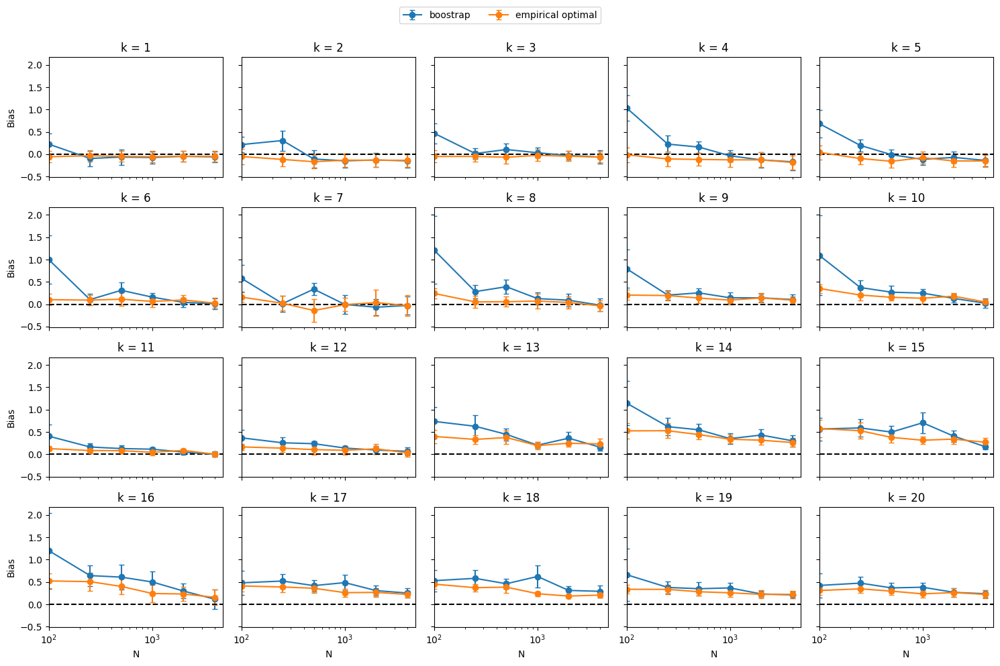
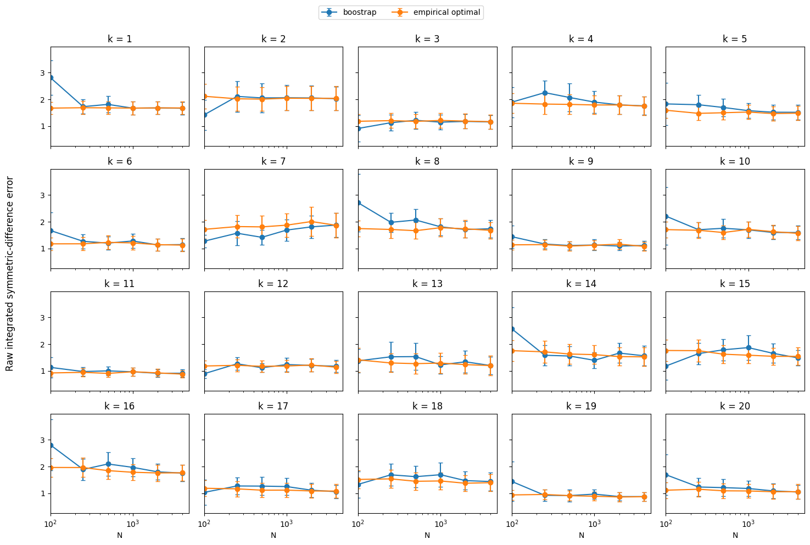
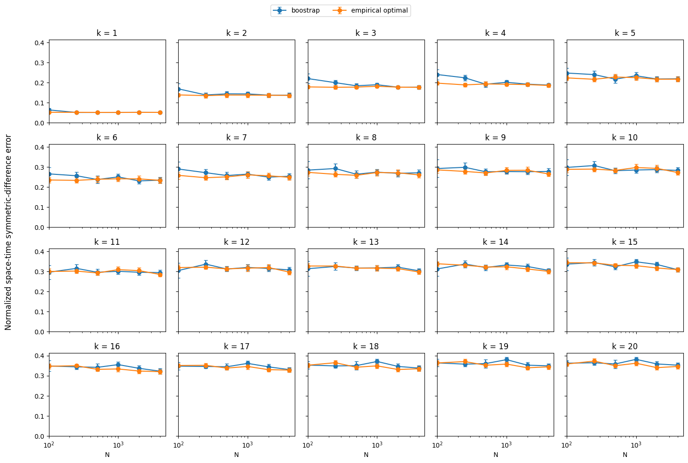

# Cell Death — Simulation et validation de filtres particulaires

Ce dépôt contient des codes de simulation et de validation numérique pour un modèle spatial stochastique de mort cellulaire.

Le modèle prend en compte :

* l'activation latente de la caspase ;
* une rétroaction positive des zones actives ;
* les morts cellulaires observées ;
* la protection locale par ERK après une mort ;
* une hétérogénéité spatiale de l'intensité d'activation dans une zone fixe en forme de **T** ;
* l'approximation de l'état latent par plusieurs filtres particulaires.

---

# 1. Structure du dépôt

```text
celldeath/
│
├── README.md
├── gillespiealgo .py
├── rejectionalgo.py
├── validate2pf.cpp
├── results.txt
├── plot.py
├── bias.png
├── validate2pf_raw_path_error.cpp
├── plot_raw_path_error.py
├── results_raw_path_error.txt
├── raw_path_error.png
├── validate2pf_normalized_path_error.cpp
├── plot_normalized_path_error.py
├── results_normalized_path_error.txt
├── normalized_path_error.png
```

Les différents fichiers correspondent à la simulation du modèle, à la validation des filtres particulaires et à la visualisation des résultats.

---

# 2. Simulation par algorithme de Gillespie

## `gillespiealgo .py`

Ce fichier implémente une simulation événementielle du modèle complet à l'aide d'un algorithme de type **Gillespie**.

Le programme considère quatre types d'événements :

1. proposition d'une activation ;
2. proposition d'une mort ;
3. disparition d'un centre actif ;
4. disparition d'une zone de protection ERK.

---

# 3. Simulation par rejet

## `rejectionalgo.py`

Ce fichier fournit une implémentation alternative fondée sur la **simulation par rejet** (*thinning*).

Pour les activations, un processus ponctuel de Poisson dominant d'intensité $\lambda_{a,1}$ est d'abord simulé sur le domaine. Chaque candidat situé en $x$ est ensuite accepté avec probabilité

```math
p_{\mathrm{acc}}(x) = \frac{\lambda_a\left(x \mid V_{t-}^a\right)}{\lambda_{a,1}}
```

soit, explicitement,

```math
p_{\mathrm{acc}}(x) =
\begin{cases}
1 & \text{si } x \in A(V_{t-}^a), \\
\dfrac{\lambda_{a,T}}{\lambda_{a,1}} & \text{si } x \in T \setminus A(V_{t-}^a), \\
\dfrac{\lambda_{a,c}}{\lambda_{a,1}} & \text{sinon.}
\end{cases}
```

Les candidats de mort sont conservés uniquement lorsqu'ils appartiennent à

```math
D_t = A(V_t^a) \setminus A(V_t^p)
```

Le script fournit également une animation du système spatial au cours du temps.

### Exécution

```bash
python rejectionalgo.py
```

---

# 4. Validation des filtres particulaires

## `validate2pf.cpp`

Ce programme C++ simule des jeux de données selon le modèle événementiel, puis compare trois méthodes particulaires :

* `bootstrap` ;
* `empirical_optimal`.

Pour chaque intervalle compris entre deux morts observées successives, on considère la quantité

```math
B_k = \int_{S_{k-1}^d}^{S_k^d} \lvert D_t \rvert \, dt
```

Ici, $\lvert D_t \rvert$ désigne l'aire de la région spatiale dans laquelle une mort peut avoir lieu au temps $t$.

Lors de la simulation des données, le programme calcule une valeur de référence $B_k^{\mathrm{true}}$. Les filtres particulaires produisent ensuite une approximation de la quantité conditionnelle associée à $B_k$ à partir des seules morts observées.

## 4.1. Filtre — `bootstrap`

Le deuxième filtre utilise la vraisemblance complète de l'observation sur l'intervalle. Son potentiel est

```math
G_k = \lambda_d \, \exp(-\lambda_d B_k) \, \mathbf{1}\left\lbrace Y_k^d \in D_{S_k^d-} \right\rbrace
```

avec

```math
B_k = \int_{S_{k-1}^d}^{S_k^d} \lvert D_t \rvert \, dt
```

Le terme $\exp(-\lambda_d B_k)$ correspond au terme de survie sur l'intervalle $\left( S_{k-1}^d, S_k^d \right)$. Plus explicitement,

```math
\exp(-\lambda_d B_k) = \exp\left( -\lambda_d \int_{S_{k-1}^d}^{S_k^d} \lvert D_t \rvert \, dt \right)
```

Dans les résultats numériques, cette méthode est appelée `bootstrap`.


---

## 4.3. Filtre  — `empirical_optimal`

Le deuxième filtre utilise une approximation empirique de la **proposition optimale**.

Pour chaque particule parent, le programme simule $M_{\mathrm{prop}}$ segments latents candidats. Pour le candidat $j$, le potentiel associé à l'observation est

```math
G_j = \lambda_d \, \exp(-\lambda_d B_j) \, \mathbf{1}\left\lbrace Y_k^d \in D_{S_k^d-}^{(j)} \right\rbrace
```

On dispose donc de candidats $H_k^{(1)}, H_k^{(2)}, \ldots, H_k^{(M_{\mathrm{prop}})}$ avec leurs poids $G_1, G_2, \ldots, G_{M_{\mathrm{prop}}}$.

Le candidat finalement conservé est sélectionné avec une probabilité proportionnelle à son potentiel :

```math
\mathbb{P}\left( J = j \mid G_1, \ldots, G_{M_{\mathrm{prop}}} \right)
= \frac{G_j}{\displaystyle\sum_{\ell=1}^{M_{\mathrm{prop}}} G_\ell}
```

Le programme utilise pour cela un **weighted reservoir sampling**. Cette méthode permet d'effectuer cette sélection sans conserver simultanément en mémoire tous les candidats.

Le poids externe de la particule est estimé par

```math
\widehat{h}_k = \frac{1}{M_{\mathrm{prop}}} \sum_{j=1}^{M_{\mathrm{prop}}} G_j
```

Dans les résultats numériques, cette méthode est appelée `A5_empirical_optimal`.

---

## 4.4. Principe de la validation

La validation repose sur une asymétrie d'information volontaire : le simulateur connaît la trajectoire cachée qu'il vient lui-même de produire, alors que les filtres particulaires ne reçoivent que les morts observées. On peut donc confronter directement l'estimation à la vérité, ce qui est impossible sur des données réelles.

### Notation

L'expérience est répétée $R$ fois. Pour une répétition donnée $r$, trois objets interviennent.

Le simulateur produit d'abord une trajectoire cachée complète, ainsi que la suite des morts observées $O_{1:k}^d$.

La valeur de référence $B_k^{\mathrm{true},(r)}$ est ensuite calculée directement le long de cette trajectoire cachée simulée. Elle est donc connue du programme, mais pas du filtre.

L'estimation $\widehat{m}_{k,N}^{(r)}$ est enfin celle que produit le filtre particulaire à $N$ particules, qui n'a accès qu'à $O_{1:k}^d$.

On compare alors la moyenne des valeurs vraies

```math
\overline{B}_{k,R}^{\mathrm{true}} = \frac{1}{R} \sum_{r=1}^{R} B_k^{\mathrm{true},(r)}
```

à la moyenne des estimations particulaires

```math
\overline{m}_{k,N,R}^{\mathrm{PF}} = \frac{1}{R} \sum_{r=1}^{R} \widehat{m}_{k,N}^{(r)}
```

### Pourquoi ces deux moyennes doivent coïncider

Par la loi des grands nombres, la moyenne des valeurs vraies converge vers l'espérance du modèle :

```math
\overline{B}_{k,R}^{\mathrm{true}} \longrightarrow \mathbb{E}_\theta[B_k]
\qquad (R \to \infty)
```

D'autre part, si le filtre particulaire approxime correctement la loi a posteriori, son estimation cible l'espérance conditionnelle

```math
\widehat{m}_{k,N} \approx \mathbb{E}_\theta[B_k \mid O_{1:k}^d]
```

et la propriété de la tour donne

```math
\mathbb{E}_\theta\left[ \mathbb{E}_\theta(B_k \mid O_{1:k}^d) \right] = \mathbb{E}_\theta[B_k]
```

Les deux moyennes visent donc la même limite. On doit ainsi observer, lorsque $N$ et $R$ sont suffisamment grands,

```math
\overline{m}_{k,N,R}^{\mathrm{PF}} - \overline{B}_{k,R}^{\mathrm{true}} \longrightarrow 0
```

Il faut souligner que l'égalité ne vaut **qu'en moyenne**. Sur une répétition isolée, $\widehat{m}_{k,N}^{(r)}$ et $B_k^{\mathrm{true},(r)}$ n'ont aucune raison de coïncider : le premier est une espérance conditionnelle sachant les observations, le second une réalisation particulière de la trajectoire cachée. C'est précisément pourquoi le critère porte sur des moyennes sur $R$ répétitions et non sur des trajectoires individuelles.

### Biais empirique

Le biais représenté dans la figure est ainsi

```math
\widehat{\mathrm{Bias}}_{k,N} = \frac{1}{R} \sum_{r=1}^{R} \left( \widehat{m}_{k,N}^{(r)} - B_k^{\mathrm{true},(r)} \right)
```

La différence est formée **répétition par répétition**, sur le même jeu de données simulé, avant d'être moyennée. Cet appariement élimine la variabilité commune aux deux termes et rend le critère nettement moins bruité que la comparaison de deux moyennes calculées séparément ; c'est la quantité dont la colonne `paired_MCSE` mesure l'erreur Monte-Carlo.

Cette comparaison est effectuée séparément pour chaque intervalle $k = 1, \ldots, 20$ et pour les trois filtres particulaires considérés.

---

# 5. Approximation de l'intégrale spatiale

Le calcul exact de l'aire $\lvert D_t \rvert$ peut être coûteux lorsque plusieurs disques actifs et plusieurs zones ERK se chevauchent. Le programme utilise donc une grille de points dans $W$.

Si la grille contient $m = g^2$ points, où $g$ est le paramètre `GRID_SIDE`, et si $n_D(t)$ désigne le nombre de points appartenant à $D_t$, alors

```math
\lvert D_t \rvert \approx n_D(t) \, \frac{\lvert W \rvert}{m}
```

Cette approximation est utilisée pour calculer numériquement

```math
B_k = \int_{S_{k-1}^d}^{S_k^d} \lvert D_t \rvert \, dt
```
---

# 6. Estimation particulaire

Pour chaque segment $k$, le filtre produit une collection de valeurs $B_k^{(1)}, \ldots, B_k^{(N)}$ associées aux particules.

Après normalisation des poids, l'estimation particulaire utilisée est

```math
\widehat{B}_{k,N} = \sum_{i=1}^{N} w_k^{(i)} B_k^{(i)}
```

Cette quantité est ensuite comparée à la valeur simulée $B_k^{\mathrm{true}}$.

# 7. Expérience de Monte-Carlo

Le programme considère plusieurs tailles de populations particulaires :

```math
N \in \lbrace 100,\; 250,\; 500,\; 1000,\; 2000,\; 4000 \rbrace
```

Pour chaque valeur de $N$, l'expérience est répétée sur $R$ jeux de données simulés indépendamment.

Les valeurs par défaut sont :

| Paramètre | Valeur | Rôle |
| --- | --- | --- |
| `R` | 500 | nombre de répétitions Monte-Carlo |
| `K` | 20 | nombre de morts observées par jeu de données |
| `GRID_SIDE` | 40 | résolution de l'approximation spatiale |
| `M_PROP` | 20 | nombre de candidats utilisés par `A5_empirical_optimal` |
| seuil ESS | 0.75 | seuil de rééchantillonnage |

---

# 8. Format des résultats

Le programme produit d'abord une ligne décrivant la configuration, par exemple :

```text
R=500  K=20  area_points=1600  ESS_threshold=0.75  M_prop=20
```

puis un tableau dont l'en-tête est

```text
N k algorithm success collapse mean_true_paired mean_PF bias abs_bias paired_MCSE
```

Les colonnes ont la signification suivante :

| Colonne | Signification |
| --- | --- |
| `N` | nombre de particules |
| `k` | numéro du segment |
| `algorithm` | méthode particulaire utilisée |
| `success` | nombre de répétitions réussies |
| `collapse` | nombre d'effondrements du système de particules |
| `mean_true_paired` | moyenne des valeurs vraies sur les répétitions réussies |
| `mean_PF` | moyenne des estimations particulaires |
| `bias` | biais moyen |
| `abs_bias` | valeur absolue du biais |
| `paired_MCSE` | erreur standard Monte-Carlo du biais apparié |

Ces colonnes reprennent les quantités définies à la section 4.4. Pour une répétition $r$, l'erreur appariée est

```math
E_{k,N}^{(r)} = \widehat{m}_{k,N}^{(r)} - B_k^{\mathrm{true},(r)}
```

et le biais empirique est sa moyenne

```math
\widehat{\mathrm{Bias}}_{k,N} = \frac{1}{R_{\mathrm{succ}}} \sum_{r=1}^{R_{\mathrm{succ}}} E_{k,N}^{(r)}
```

où $R_{\mathrm{succ}}$ (colonne `success`) désigne le nombre de répétitions dont le filtre n'a pas subi d'effondrement. La moyenne porte donc sur $R_{\mathrm{succ}}$ et non sur $R$ : les répétitions comptabilisées dans la colonne `collapse` sont exclues, et la colonne `success` doit être lue conjointement au biais, un biais faible obtenu sur peu de répétitions réussies n'ayant pas la même valeur qu'un biais faible obtenu sur toutes.

La colonne `paired_MCSE`, notée ici $\mathrm{MCSE}^{\mathrm{paired}}_{k,N}$, mesure l'erreur Monte-Carlo associée à cette estimation du biais. C'est elle qui fournit les barres d'erreur de la figure.

Le fichier `results.txt` contient les résultats associés à $B_k$.

---

# 9. Visualisation des résultats

## `plot.py`

Ce script lit `results.txt` et affiche les courbes de `bootstrap` et de `empirical_optimal` . Pour chaque intervalle, il représente `bias` avec des barres d'erreur de ±1 `paired_MCSE`.

## Deux autres critères de validation

| Programme C++ | Script Python | Critère représenté |
| --- | --- | --- |
| `validate3pf_raw_path_error.cpp` | `plot_raw_path_error.py` | `raw_symdiff_error` ± `raw_symdiff_MCSE` |
| `validate3pf_normalized_path_error.cpp` | `plot_normalized_path_error.py` | `normalized_symdiff_error` ± `normalized_symdiff_MCSE` |

Le premier programme calcule, pour chaque particule, l'intégrale temporelle de l'aire de la différence symétrique entre sa zone de mort et celle de la trajectoire simulée. Il moyenne ces distances avec les poids particulaires, puis sur les répétitions réussies. Le second calcule aussi la version normalisée : chaque erreur est divisée par la durée du segment multipliée par l'aire de la fenêtre avant la moyenne Monte-Carlo.

```math
d_k^{(i)}=\int_{S_{k-1}^d}^{S_k^d}|D_t^{(i)}\triangle D_t^{\mathrm{true}}|\,dt,
\qquad d_k^{(i),\mathrm{norm}}=\frac{d_k^{(i)}}{(S_k^d-S_{k-1}^d)|W|}.
```

Les scripts Python représentent ces critères pour chaque intervalle, avec leurs erreurs standard Monte-Carlo. Les figures fournies affichent les deux méthodes bootstrap et empirical optimal ;

Pour utiliser les noms des images ci-dessous, passer explicitement le fichier de sortie :

```bash
python3 plot.py results.txt bias.png
python3 plot_raw_path_error.py results_raw_path_error.txt raw_path_error.png
python3 plot_normalized_path_error.py results_normalized_path_error.txt normalized_path_error.png
```

# 10. Dépendances Python

Les scripts Python utilisent principalement :

```text
numpy
matplotlib
pandas
```

Installation :

```bash
pip install numpy matplotlib pandas
```

---

# 11. Résultats graphiques

Les trois figures comparent le filtre bootstrap (`bootstrap`, en bleu) et la proposition optimale empirique (`empirical_optimal`, en orange). Chaque panneau correspond à un intervalle $k=1,\ldots,20$. L'axe du nombre de particules est logarithmique et commence à $N=100$. Les barres d'erreur représentent ±1 erreur standard Monte-Carlo, et non un intervalle de confiance à 95 %. Les moyennes portent sur les répétitions réussies ; les colonnes `success` et `collapse` doivent donc être examinées conjointement.

## 11.1. Biais de l'estimation de l'aire intégrée



La ligne pointillée indique un biais nul. Pour plusieurs intervalles, le biais se rapproche de zéro lorsque le nombre de particules augmente, mais des écarts positifs subsistent pour certains intervalles.

## 11.2. Erreur de chemin non normalisée



Ce critère mesure un désaccord spatial cumulé dans le temps. Il dépend de la durée de l'intervalle et de la taille du domaine. Les deux méthodes donnent des résultats proches aux grandes tailles de population.

## 11.3. Erreur de chemin normalisée



Le critère normalisé appartient à $[0,1]$ et permet de comparer des intervalles de durées différentes. Pour plusieurs des derniers intervalles, les valeurs restent proches de 0,30 à 0,35. Une erreur non nulle peut subsister même avec un filtrage exact, du fait de l'incertitude sur le chemin caché sachant les observations : elle ne constitue pas, à elle seule, une preuve d'un biais du filtre.
